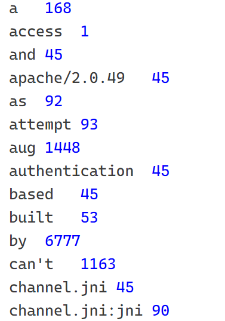
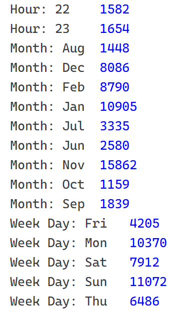
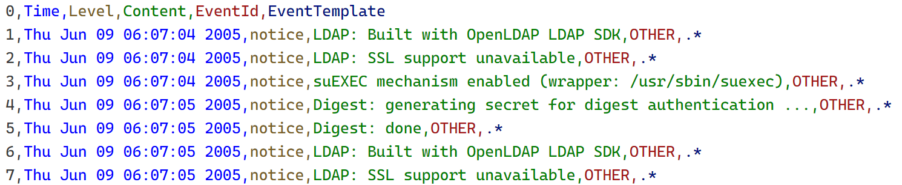
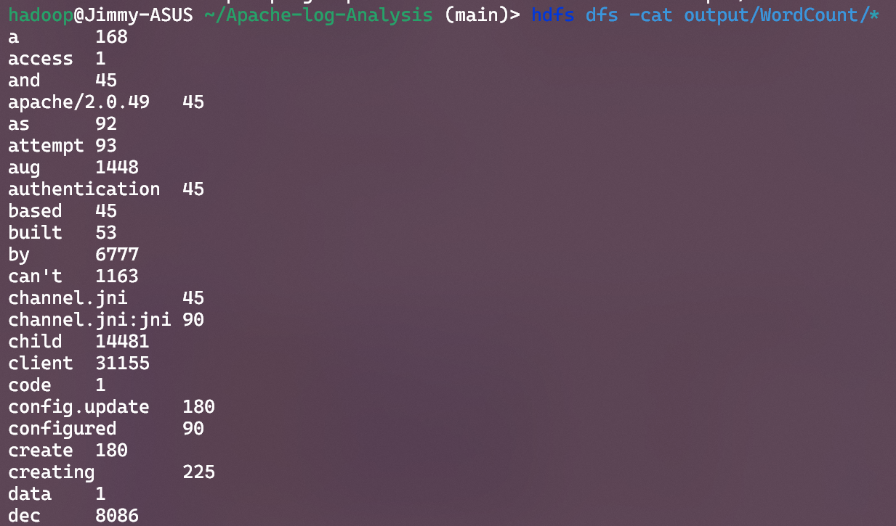
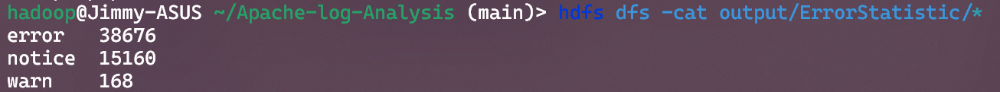
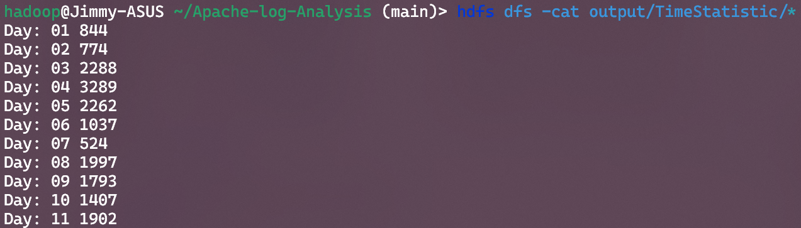
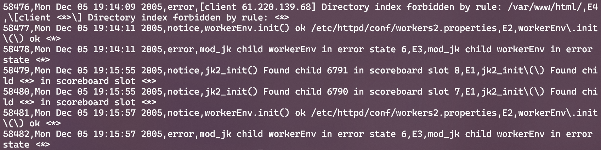

*converted from .tex to .md by `pandoc`*

# 大数据技术与应用实验报告

## 数据集描述

将使用一个包含 Apache Web 服务器日志的数据集进行实验。Apache
服务器通常生成两种类型的日志：访问日志和错误日志。我们提供错误日志，用于研究异常检测和诊断。该日志文件是从运行
Apache Web 服务器的Linux系统上收集的。该数据集包含以下文件：

1.  **`Apache_2k.log`**：这是一个原始的 Apache Web
    服务器日志文件，包含了 2000
    条日志记录。这些日志记录未经处理，保留了日志的原始格式。

2.  **`Apache_2k.log_structured.csv`**：这是一个结构化的 CSV
    文件，包含了与 `Apache_2k.log`
    相同的日志数据，但已经被解析并转换为表格格式，便于分析。

3.  **`Apache_2k.log_templates.csv`**：这个文件包含了用于解析 Apache
    日志的模板，可以帮助学生理解日志的格式和结构。

4.  **`Apache.log`**：这是一个更大的 Apache Web
    服务器日志文件，包含了更多的日志记录，用于更复杂的分析和处理。

5.  **`README.md`**：这是一个说明文件，提供了数据集的详细信息和使用指南。

## 实验目标

学⽣将使⽤ Java 编程语⾔和 MapReduce 框架在伪分布式 Hadoop
环境中处理这些⽇志⽂件，提取有⽤信息，并⽣成分析报告。

## 实验要求

-   **环境设置**：在本地机器上配置伪分布式 Hadoop 环境

-   **数据准备**：使用提供的 Apache 日志数据集，特别是 `Apache_2k.log`
    和 `Apache.log` 文件

-   **任务描述**：编写一个 MapReduce 程序，完成以下任务：

    1.  **词频统计**：统计日志文件中每个单词出现的次数。

    2.  **错误日志统计**：识别并统计日志文件中出现的错误类型和次数。

    3.  **时间序列分析**：分析日志文件中的时间戳，找出访问高峰期。

    4.  **日志格式解析**：使用 `Apache_2k.log_templates.csv`
        文件中的模板，解析 `Apache_2k.log`
        文件中的日志记录，并将其转换为结构化的格式。

## 实验内容

### 实验准备

#### 环境配置

-   **操作系统**： Linux (Windows Subsystem for Linux, Ubuntu 22.04 LTS)

-   **Java 开发环境**： OpenJDK 1.8.0

-   **Hadoop 环境**： Hadoop 3.4.0 (伪分布式)

-   **开发工具**：Visual Studio Code (*1.95.3*), with Extension Pack for
    Java (*v0.29.0*)

#### 项目结构

-   **`src/`**：Java 源代码目录

    -   **[`WordCount.java`](#code:WordCount.java)**：词频统计任务

    -   **[`ErrorStatistic.java`](#code:ErrorStatistic.java)**：错误日志统计任务

    -   **[`TimeStatistic.java`](#code:TimeStatistic.java)**：时间序列分析任务

    -   **[`LogStructuring.java`](#code:LogStructuring.java)**：日志格式解析任务

    -   **[`Event.java`](#code:Event.java)**：日志事件类

    -   **[`ApacheLogAnalysis.java`](#code:ApacheLogAnalysis.java)**：主程序入口

-   **`input/`**：输入目录（调试用）

    -   **`Apache_2k.log`**：Apache 日志文件 -- 拷贝自数据集

    -   **`Apache.log`**：更大的 Apache 日志文件 -- 拷贝自数据集

-   **`output/`**：输出目录（调试用）

    -   **`WordCount/`**：词频统计结果

    -   **`ErrorStatistic/`**：错误日志统计结果

    -   **`TimeStatistic/`**：时间序列分析结果

    -   **`LogStructuring/`**：日志格式解析结果

-   **`.vscode/`**：Visual Studio Code 配置目录

    -   **`launch.json`**：调试配置文件

    -   **`settings.json`**：编辑器配置文件

#### 开发配置

-   **`settings.json`**：编辑器配置文件

    在 Java 开发中，需要导入 Hadoop 相关库，以便在 Visual Studio Code
    中进行代码补全和调试。首先需要在选择当前工作区的
    JDK（若系统中安装了多个 JDK）与编译器字节码版本为 1.8，并在
    `.vscode/settings.json` 文件中添加以下配置：

    ``` {.python language="python"}
    {
        "java.project.sourcePaths": [
            "src"
        ],
        "java.project.referencedLibraries": [
            "/usr/local/hadoop/share/hadoop/common/hadoop-nfs-3.4.0.jar",
            "/usr/local/hadoop/share/hadoop/common/hadoop-common-3.4.0.jar",
            "/usr/local/hadoop/share/hadoop/common/lib/*.jar",
            "/usr/local/hadoop/share/hadoop/mapreduce/*.jar",
            "/usr/local/hadoop/share/hadoop/yarn/*.jar",
            "/usr/local/hadoop/share/hadoop/hdfs/*.jar",
        ],
    }
    ```

-   **`launch.json`**：调试配置文件

    在开发各功能时，欲简化调试，避免多次在终端执行带参数的命令，可在调试配置中预设各功能的输入输出路径
    Java 运行的参数。例如需要调试词频统计功能，则在
    `.vscode/launch.json` 文件中添加如下配置：

    ``` {.python language="python" firstline="6" lastline="14"}
        "configurations": [
            {
                "type": "java",
                "name": "WordCount",
                "request": "launch",
                "mainClass": "WordCount",
                "projectName": "Apache-log-Analysis_36fd119b",
                "args": "input output"
            },
    ```

### 实验设计

#### 词频统计 [`WordCount.java`](#code:WordCount.java) {#sec:WordCount}

1.  MapReduce 设计思路

    -   **Mapper**：将日志文件中的每一行拆分为单词，输出键值对形如
        `<word, 1>`。类型为 `<Text, IntWritable>`。

    -   **Combiner**：与 Reducer 相同[^1]，在 Mapper 输出之后，对 Mapper
        输出的键值对进行合并，减少数据传输量

    -   **Reducer**：对 Mapper
        输出的键值对进行合并，统计每个单词出现的次数

    {#fig:WordCount
    width="80%"}

2.  分词规则

    分词将在 Mapper
    中实现。由于在日志中有大量类似时间、特殊符号等字段，直接以空格分词出的结果显得杂乱。故需要处理、筛选出更有意义的单词。

    1.  **删除首尾符号**：出现在首尾的符号大多为分隔的标点，并无实际区分意义。使用正则表达式
        `"^[\\pP]+|[\\pP]+$"`{.java}
        匹配单词进行替换，删掉在首尾的非字母字符。例如 `[Sun` → `Sun`,
        `[notice]` → `notice`, `jk2_init()` → `jk2_init` 等

    2.  **转换为小写**：统一单词的大小写，避免同一单词因大小写不同而被视为不同单词

    3.  **过滤以数字开头的单词**：由于以数字开头的一般是时间戳、IP
        地址等非标识符或信息字段，在分词的结果中不应包含此类单词。例如去除
        `07:21:02`, `4907` 等，但不去除 `jk2_init()`
        之类的虽含有数字，但不以数字开头的单词

    4.  **过滤空字符串**：在处理后可能出现空字符串，应将其过滤

    对于以上规则，在 Mapper 中，对每一行日志进行处理，详见
    [\[code:WordCount.java\]](#code:WordCount.java){reference-type="ref+label"
    reference="code:WordCount.java"}。将处理后的**单词作为键，值为 1**
    输出。

3.  统计

    统计在 Reducer 中实现。对 Mapper
    输出的键值对进行合并，统计每个单词出现的次数。最终输出键值对形如
    `<word, count>`。Combiner 与 Reducer 的任务一致，故共用同一个类。

#### 错误日志统计 [`ErrorStatistic.java`](#code:ErrorStatistic.java) {#sec:ErrorStatistic}

1.  MapReduce 设计思路

    -   **Mapper**：将日志文件中的每一行事件解析出日志事件类型，输出键值对
        `<level, 1>`，类型为 `<Text, IntWritable>`。

    -   **Combiner**：与 Reducer 相同，对 Mapper
        输出的键值对进行合并，减少数据传输量

    -   **Reducer**：对 Mapper
        输出的键值对进行合并，统计每个错误级别出现的次数

    MapReduce 设计与 [1](#fig:WordCount){reference-type="ref+label"
    reference="fig:WordCount"}
    类似，只是键值对的键变为了日志事件的级别。

2.  日志事件解析

    由于在本任务与
    [4.2.3](#sec:TimeStatistic){reference-type="ref+label"
    reference="sec:TimeStatistic"} 和
    [4.2.4](#sec:LogStructuring){reference-type="ref+label"
    reference="sec:LogStructuring"}
    中，有大量利用一行日志中的多个字段进行分析的任务，故需要将日志解析为一个事件类。在
    [`Event.java`](#code:Event.java) 中定义了日志事件类。

    该类通过正则表达式 `"\\[(.*?)\\] \\[(.*?)\\] (.*)"`{.java}
    解析分别匹配一行日志中的时间（用于
    [4.2.3](#sec:TimeStatistic){reference-type="ref+label"
    reference="sec:TimeStatistic"}）、事件级别（用于
    [4.2.2](#sec:ErrorStatistic){reference-type="ref+label"
    reference="sec:ErrorStatistic"}）、事件内容。并根据事件内容以正则表达式匹配模板得出事件类型，用于
    [4.2.4](#sec:LogStructuring){reference-type="ref+label"
    reference="sec:LogStructuring"} 中的任务。

    例如：

    > `[Mon Dec 05 07:21:09 2005] [error] mod_jk child workerEnv in error state 6`
    >
    > 通过正则表达式解析，得到的第 2 个字段即为事件级别 `error`。

    在 Mapper 中，对每一行日志调用 `Event`
    类，将日志解析为事件类，将处理后解析到的**事件级别作为键，值为 1**
    输出。对于无法解析的日志（不符合正则表达式），则跳过解析该事件。详见
    [\[code:ErrorStatistic.java\]](#code:ErrorStatistic.java){reference-type="ref+label"
    reference="code:ErrorStatistic.java"}。

3.  统计

    统计在 Reducer 中实现。对 Mapper
    输出的键值对进行合并，统计每个错误级别出现的次数。最终输出键值对形如
    `<level, count>`。Combiner 与 Reducer 的任务一致，故共用同一个类。

#### 时间序列分析 [`TimeStatistic.java`](#code:TimeStatistic.java) {#sec:TimeStatistic}

1.  MapReduce 设计思路

    -   **Mapper**：将日志文件中的每一行事件解析出时间（特征），输出键值对
        `<time, 1>`，类型为 `<Text, IntWritable>`。

    -   **Combiner**：与 Reducer 相同，对 Mapper
        输出的键值对进行合并，减少数据传输量

    -   **Reducer**：对 Mapper
        输出的键值对进行合并，统计每个时间出现的次数

    MapReduce 设计与 [1](#fig:WordCount){reference-type="ref+label"
    reference="fig:WordCount"}
    类似，只是键值对的键变为了日志事件的时间（特征）。

2.  时间（特征）解析

    本任务直接使用在
    [4.2.2](#sec:ErrorStatistic){reference-type="ref+label"
    reference="sec:ErrorStatistic"} 中提及的 `Event`
    类，解析日志出中的时间字段。 例如：

    > `[Mon Dec 05 07:21:09 2005] [error] mod_jk child workerEnv in error state 6`
    >
    > 通过正则表达式解析，得到的第 1 个字段即为时间
    > `Mon Dec 05 07:21:09 2005`。

    然而，解析每个时间戳，并没有实际的统计意义。需要将时间的特征解析出来。通过正则表达式
    `"([A-Za-z]+) ([A-Za-z]+) (\\d{2}) (\\d{2}):\\d{2}:\\d{2} \\d{4}"`{.java}
    可以分别解析出时间的星期、月份、日、时、分、秒、年份字段。

    为了解析出更符合统计用途的信息，该任务将将时间按 日、星期、月份和时
    区分，并加上区分的类型，以便在检查时更方便得到区分的依据。详见
    [\[code:TimeStatistic.java\]](#code:TimeStatistic.java){reference-type="ref+label"
    reference="code:TimeStatistic.java"}。

    例如：

    > `[Mon Dec 05 07:21:09 2005] [error] mod_jk child workerEnv in error state 6`
    >
    > 通过正则表达式解析，得到的时间 `Mon Dec 05 07:21:09 2005`
    >
    > 解析出的特征为 `Week Day: Mon`, `Month: Dec`, `Day: 05`,
    > `Hour: 07`。

    在 Mapper 中，将这些**特征分别都作为键，值为 1**
    输出。也就是说，对于每一行日志，将解析出 4 个键值对输出。

3.  统计

    统计在 Reducer 中实现。对 Mapper
    输出的键值对进行合并，统计每个时间（特征）出现的次数。最终输出键值对形如
    `<time_feature, count>`。Combiner 与 Reducer
    的任务一致，故共用同一个类。

#### 日志格式解析 `LogStructuring.java` {#sec:LogStructuring}

1.  MapReduce 设计思路

    对于每一行日志，都需要将其解析为 CSV
    的结构化格式。因此不存在键值合并的问题，故不需要 Combiner 或
    Reducer。只需要 Mapper 即可完成任务。设计键值对为
    `<id, structured_info>`，类型为 `<IntWritable, Text>`。

    {#fig:LogStructuring width="80%"}

2.  日志解析

    在 Event
    类中，已经实现了对一行日志的信息解析。对事件模板的匹配，代码中首先将多个事件字符串格式的模板以正则表达式的方式写在类中，再以正则表达式的方式去匹配事件信息，实现对事件的分类。

    例如：

    > 在模板中，E3 的模板被定义为
    > `mod_jk child workerEnv in error state <*>`
    >
    > 则在定义 Java 正则表达式时，被定义为
    > `E3("mod_jk child workerEnv in error state \\S+")`{.java}

    Event 类中还实现了 `.toString()` 方法，将解析后的信息以 CSV
    格式输出。

    例如：

    > `[Mon Dec 05 07:21:09 2005] [error] mod_jk child workerEnv in error state 6`
    >
    > 解析后的信息为
    >
    > `Mon,Dec,05,07,error,mod\_jk child workerEnv in error state 6,E3,mod_jk child workerEnv in error state <*>`
    >
    > 分别对应星期、月份、日期、小时、事件级别、事件内容、事件类型、事件模板。

    在 Mapper 中，对每一行日志调用 `Event`
    类，将日志解析为事件类，并使用 `.toString()`
    方法得到结构化的信息。使用一个累加器，将将递增的**行号作为键，结构化的信息作为值**输出。详见
    [\[code:LogStructuring.java\]](#code:LogStructuring.java){reference-type="ref+label"
    reference="code:LogStructuring.java"}。

3.  输出格式调整

    1.  **输出表头**：在期望的输出中，CSV
        表格的首行应为表头，包含各字段的名称。则在 Mapper
        中，将表头作为键为
        0，值为表头各字段名称的字符串输出。`"Time,Level,Content,EventId,EventTemplate"`{.java}。

    2.  **调整输出格式**：由于在 MapReduce
        中，默认的输出格式是将键与值以 Tab
        分隔，因此需要在输出时将键与值设置为以逗号分隔类似
        `0,Time,Level,Content,EventId,EventTemplate`。

        设置
        `conf.set("mapreduce.output.textoutputformat.separator", ",");`{.java}
        ，再以该 `conf` 创建 `Job`{.java} 对象。

#### 主程序入口 [`ApacheLogAnalysis.java`](#code:ApacheLogAnalysis.java)

虽然在每个任务中都有主函数入口，方便单独运行某个任务；但这些入口只是为了方便调试。而设计一个主程序入口，可以在一个程序中运行所有任务，方便统一输出管理。

1.  文件输入输出路径

    -   对于 MapReduce
        中，文件的输入路径可以为文件夹的路径，这样会对文件夹下的所有文件进行处理。因此，将日志文件数据集放在同一个文件夹下，方便统一处理。

    -   由于 MapReduce
        不允许输出路径中存在已有的文件，故在得到输出路径后，需要判断该路径是否存在，若存在询问用户删除该路径。

    -   输入输出路径皆由参数传入，方便在命令行中调用。

2.  任务调用

    1.  由于各任务的输出需要保存在不同的文件夹，需要对输出路径进行处理。将各任务的输出路径设置为原输出目录下的各以任务名命名的子文件夹。

    2.  调用各任务已编写的 `getJob()`{.java} 方法，得到任务的 Job 对象。

    3.  提交任务，等待任务完成。

### 实验验证

在迁移到 Hadoop
环境中运行前，先尝试在本地环境中运行，以验证程序的正确性。

在 `launch.json` 中主程序入口的配置，将参数设为
`input output`，即输入输出路径，在 VS Code 中选择该配置即可启动。

``` {.python language="python" firstline="39" lastline="46"}
        {
            "type": "java",
            "name": "Main",
            "request": "launch",
            "mainClass": "ApacheLogAnalysis",
            "projectName": "Apache-log-Analysis_36fd119b",
            "args": "input output"
        }
```

待程序运行完成后，查看 `output/` 目录下有 4
个目录，分别为各任务的输出结果。每个目录下有 `part-r-00000`
文件，即为任务的输出结果。可以使用 `cat` 命令查看文件内容。

``` {.bash language="bash"}
$ cat output/ErrorStatistic/*
error   38676
notice  15160
warn    168
```

其他任务的输出结果太长，仅用使用截图展示部分输出。

<figure id="fig:Val-Results">
<figure id="fig:Val-WordCount">

<figcaption>词频统计 WordCount 输出结果</figcaption>
</figure>
<figure id="fig:Val-TimeStatistic">

<figcaption>时间统计 TimeStatistic 输出结果</figcaption>
</figure>
<figure id="fig:Val-LogStructuring">

<figcaption>日志格式解析 LogStructuring 输出结果</figcaption>
</figure>
<figcaption>本地环境运行结果</figcaption>
</figure>

### 实验测试及结果

#### 打包为 JAR 文件

在本地环境中运行成功后，将程序打包为 JAR 文件，以便在 Hadoop
环境中运行。

1.  在 VS Code 的 Java 插件中，找到 "Java: Export JAR File" 命令。

2.  选择以 `ApacheLogAnalysis` 为主类，并包含所有依赖项。

3.  待生成任务完成后，即可在工作目录下找到 `Apache-log-Analysis.jar`
    文件。

#### 将数据集上传至 HDFS

1.  执行 `start-dfs.sh`{.bash}命令，启动 HDFS。

2.  执行 `hdfs dfs -put input input`{.bash} 命令，将本地的 `input`
    文件夹上传至 HDFS。

3.  上传完成后，查看上传结果。

    ``` {.bash language="bash"}
    $ hdfs dfs -ls input
    Found 2 items
    -rw-r--r--   1 hadoop supergroup    5135876 2024-11-23 19:46 input/Apache.log
    -rw-r--r--   1 hadoop supergroup     171239 2024-11-23 19:46 input/Apache_2k.log
    ```

#### 在 Hadoop 环境中运行

1.  执行
    `hadoop jar Apache-log-Analysis.jar input output`{.bash}，即可在
    Hadoop 环境中运行 JAR 文件。指定输入输出路径。

2.  运行完成后，查看输出目录下的结果。

    ``` {.bash language="bash"}
    $ hdfs dfs -ls output
    Found 4 items
    drwxr-xr-x   - hadoop supergroup          0 2024-11-23 20:01 output/ErrorStatistic
    drwxr-xr-x   - hadoop supergroup          0 2024-11-23 20:01 output/LogStructuring
    drwxr-xr-x   - hadoop supergroup          0 2024-11-23 20:01 output/TimeStatistic
    drwxr-xr-x   - hadoop supergroup          0 2024-11-23 20:01 output/WordCount
    ```

    可见，各任务的输出结果已保存在 HDFS 中。

#### 检查输出结果

1.  使用 `hdfs dfs -cat output/WordCount/*`{.bash}
    查看词频统计的输出结果。

2.  使用 `hdfs dfs -cat output/ErrorStatistic/*`{.bash}
    查看错误日志统计的输出结果。

3.  使用 `hdfs dfs -cat output/TimeStatistic/*`{.bash}
    查看时间序列分析的输出结果。

4.  使用 `hdfs dfs -cat output/LogStructuring/*`{.bash}
    查看日志格式解析的输出结果。

输出结果过长，仅展示部分结果。

<figure id="fig:Val-Results">
<figure id="fig:Val-WordCount">

<figcaption>词频统计 WordCount 输出结果</figcaption>
</figure>
<figure id="fig:Val-ErrorStatistic">

<figcaption>错误日志统计 ErrorStatistic 输出结果</figcaption>
</figure>
<figure id="fig:Val-TimeStatistic">

<figcaption>时间序列分析 TimeStatistic 输出结果</figcaption>
</figure>
<figure id="fig:Val-LogStructuring">

<figcaption>日志格式解析 LogStructuring 输出结果</figcaption>
</figure>
<figcaption>Hadoop 环境运行结果</figcaption>
</figure>

#### 结果分析

**词频统计**的结果中，可以看到各个词的出现次数；**错误日志统计**的结果中，可以看到各个错误级别的出现次数；均可在终端中直观地查看结果，无须进行进一步分析。

对于**时间序列分析**，可以看到每个小时的日志数量，可以 Python 与
Matplotlib 进行简单的可视化分析。

<figure>
<figure>
<embed src="img/Day.eps" />
<figcaption>日分布图</figcaption>
</figure>
<figure>
<embed src="img/Hour.eps" />
<figcaption>时分布图</figcaption>
</figure>
<figure>
<embed src="img/Week Day.eps" />
<figcaption>星期分布图</figcaption>
</figure>
<figure>
<embed src="img/Month.eps" />
<figcaption>月分布图</figcaption>
</figure>
<figcaption>时间序列分析结果可视化</figcaption>
</figure>

对于**日志格式解析**，使用命令
`hdfs dfs -cat output/LogStructuring/* > output/LogStructuring.csv`{.bash}
将结果保存为 CSV 文件，再使用 Excel 进行可视化。

{#fig:LogStructuring-csv width="80%"}

## 实验感想

在这次实验中，我初步理解了 MapReduce 的框架与基本原理。通过实验，我对
Hadoop
编程有一定的了解，大数据处理有了更深入的了解，对数据处理的流程有了更清晰的认识。由于对
Java
语言的不熟练，在实验中，我遇到了不少问题，如如何处理日志中的特殊字符、如何解析日志中的时间等。通过查阅资料和实践，我解决了这些问题。这次实验让我受益匪浅，我收获颇丰。

## 附：实验代码 {#附实验代码 .unnumbered}

``` {#code:WordCount.java .java language="java" label="code:WordCount.java" caption="词频统计 \\texttt{WordCount.java}"}
import java.io.IOException;
import java.util.StringTokenizer;
import org.apache.hadoop.conf.Configuration;
import org.apache.hadoop.fs.Path;
import org.apache.hadoop.io.IntWritable;
import org.apache.hadoop.io.Text;
import org.apache.hadoop.mapreduce.Job;
import org.apache.hadoop.mapreduce.Mapper;
import org.apache.hadoop.mapreduce.Reducer;
import org.apache.hadoop.mapreduce.lib.input.FileInputFormat;
import org.apache.hadoop.mapreduce.lib.output.FileOutputFormat;
import org.apache.hadoop.util.GenericOptionsParser;

/**
 * A Hadoop MapReduce to count the number of each word in logs.
 */
public class WordCount {

    /**
     * <p>
     * <code>MyMapper</code> is a <code>Mapper</code> class that extends the Hadoop
     * Mapper class. It processes input key-value pairs to generate a set of
     * intermediate key-value pairs.
     * </p>
     * 
     * <p>
     * The <code>map</code> method takes an input key-value pair and tokenizes the
     * value (which is a line of text). For each token (word) in the line, it writes
     * the word and a count of one to the context.
     * </p>
     * 
     * <p>
     * Key: <code>Object</code> (not used in this implementation) Value:
     * <code>Text</code> (a line of text from the input)
     * </p>
     * 
     * <p>
     * Output Key: <code>Text</code> (a word from the input line) Output Value:
     * <code>IntWritable</code> (the count of the word, which is always 1 in this
     * case)
     * </p>
     */
    private static class MyMapper extends Mapper<Object, Text, Text, IntWritable> {
        private final static IntWritable one = new IntWritable(1);
        private Text word = new Text();

        @Override
        public void map(Object key, Text value, Context context) throws IOException, InterruptedException {
            StringTokenizer itr = new StringTokenizer(value.toString());
            while (itr.hasMoreTokens()) {
                String token = itr.nextToken();
                token = token.replaceAll("^[\\pP]+|[\\pP]+$", "").toLowerCase(); // remove punctuations, to lowercase
                if (token.isEmpty() || Character.isDigit(token.charAt(0))) // ignore empty strings and numbers
                    continue;
                word.set(token);
                context.write(word, one);
            }
        }
    }

    /**
     * <p>
     * A Reducer class that extends the Hadoop Reducer class. It processes a set of
     * intermediate key-value pairs to generate a set of output key-value pairs.
     * </p>
     * 
     * <p>
     * The <code>reduce</code> method sums up all the IntWritable values associated
     * with a given key and writes the key and the sum to the context.
     * </p>
     * 
     * <p>
     * Key: Text (a word from the input line) Value: IntWritable (the count of the
     * word, which is always 1 in this case)
     * </p>
     * 
     * <p>
     * Output Key: Text (a word from the input line) Output Value: IntWritable (the
     * total count of the word)
     * </p>
     */
    private static class MyReducer extends Reducer<Text, IntWritable, Text, IntWritable> {
        private IntWritable result = new IntWritable();

        @Override
        public void reduce(Text key, Iterable<IntWritable> values, Context context)
                throws IOException, InterruptedException {
            int sum = 0;
            for (IntWritable val : values) {
                sum += val.get();
            }
            result.set(sum);
            context.write(key, result);
        }
    }

    /**
     * A combiner class that extends the {@link MyReducer} class.
     * 
     * It is an alias of {@link MyReducer}. This can help in reducing the amount of
     * data transferred across the network. Accelarates the process of reducing the
     * data.
     */
    private static class MyCombiner extends MyReducer {
    }

    /**
     * Configures and returns a new Hadoop Job for counting words.
     *
     * @param conf   the Hadoop configuration to use for the job
     * @param input  the input path for the job
     * @param output the output path for the job
     * @return a configured Job instance for word counting
     */
    public static Job getJob(Configuration conf, Path input, Path output) throws IOException {
        Job job = new Job(conf, "word count");
        job.setJarByClass(WordCount.class);
        job.setMapperClass(MyMapper.class);
        job.setCombinerClass(MyCombiner.class);
        job.setReducerClass(MyReducer.class);
        job.setOutputKeyClass(Text.class);
        job.setOutputValueClass(IntWritable.class);
        FileInputFormat.addInputPath(job, input);
        FileOutputFormat.setOutputPath(job, output);
        return job;
    }

    public static void main(String[] args) throws Exception {
        Configuration conf = new Configuration();
        String[] otherArgs = new GenericOptionsParser(conf, args).getRemainingArgs();
        if (otherArgs.length != 2) {
            System.err.println("Usage: wordcount <in> <out>");
            System.exit(2);
        }
        Job job = getJob(conf, new Path(otherArgs[0]), new Path(otherArgs[1]));
        System.exit(job.waitForCompletion(true) ? 0 : 1);
    }
}
```

``` {#code:Event.java .java language="java" label="code:Event.java" caption="日志事件类 \\texttt{Event.java}"}
import java.util.regex.*;


/**
 * The Event class represents a log event with a specific time, level, content, and event ID.
 * It parses a log line to extract these details and determine the event ID based on predefined patterns.
 */
public class Event {
    private String time;
    private String level;
    private String content;
    private EventId eventId;

    /**
     * Enum representing various event identifiers with their associated regular expressions.
     * Each event identifier corresponds to a specific log pattern.
     */
    public enum EventId {
        E1("jk2_init\\(\\) Found child \\S+ in scoreboard slot \\S+"), E2("workerEnv\\.init\\(\\) ok \\S+"),
        E3("mod_jk child workerEnv in error state \\S+"),
        E4("\\[client \\S+\\] Directory index forbidden by rule: \\S+"),
        E5("jk2_init\\(\\) Can't find child \\S+ in scoreboard"), E6("mod_jk child init \\S+ \\S+"), OTHER(".*");

        private final String regex;

        EventId(String regex) {
            this.regex = regex;
        }

        public String getRegex() {
            return regex;
        }

    }

    /**
     * Constructs an Event object by parsing a log line.
     *
     * @param line the log line to be parsed
     * 
     * The log line is expected to be in the format:
     * [time] [level] content
     * 
     * The constructor uses a regular expression to extract these components
     * and assigns them to the corresponding fields. It also attempts to match
     * the content against predefined event types (EventId) and assigns the
     * matching event type to the eventId field.
     */
    Event(String line) {
        final Pattern pattern = Pattern.compile("\\[(.*?)\\] \\[(.*?)\\] (.*)");
        final Matcher matcher = pattern.matcher(line);

        if (matcher.find()) {
            time = matcher.group(1);
            level = matcher.group(2);
            content = matcher.group(3);
            for (EventId eventType : EventId.values()) {
                if (content.matches(eventType.getRegex())) {
                    eventId = eventType;
                    break;
                }
            }
        }
    }

    /**
     * Checks if the event has been parsed successfully.
     * 
     * @return true if all required fields (time, level, content, eventId) are not null, false otherwise.
     */
    public Boolean isParsed() {
        if (time == null || level == null || content == null || eventId == null) {
            return false;
        }
        return true;
    }

    /**
     * Returns a string representation of the Event object in CSV format.
     * 
     * @return a string representation of the Event object.
     */
    @Override
    public String toString() {
        return isParsed()
                ? time + "," + level + "," + content + "," + eventId.name() + ","
                        + eventId.getRegex().replaceAll("\\\\S\\+", "<*>")
                : "Unparsed";
    }

    public String getTime() {
        return time;
    }

    public String getContent() {
        return content;
    }

    public String getLevel() {
        return level;
    }

    public EventId gerEventId() {
        return eventId;
    }
}
```

``` {#code:ErrorStatistic.java .java language="java" label="code:ErrorStatistic.java" caption="错误日志统计 \\texttt{ErrorStatistic.java}"}
import java.io.IOException;

import org.apache.hadoop.conf.Configuration;
import org.apache.hadoop.fs.Path;
import org.apache.hadoop.io.IntWritable;
import org.apache.hadoop.io.Text;
import org.apache.hadoop.mapreduce.Job;
import org.apache.hadoop.mapreduce.Mapper;
import org.apache.hadoop.mapreduce.Reducer;
import org.apache.hadoop.mapreduce.lib.input.FileInputFormat;
import org.apache.hadoop.mapreduce.lib.output.FileOutputFormat;
import org.apache.hadoop.util.GenericOptionsParser;

/**
 * A Hadoop MapReduce to count the number of each type of errors in logs.
 */
public class ErrorStatistic {

    /**
     * <p>
     * MyMapper is a static inner class that extends the Mapper class. It processes
     * input key-value pairs to generate a set of intermediate key-value pairs.
     * </p>
     * 
     * <p>
     * The <code>map</code> method processes each line of the input, parses it into
     * an Event object, and checks if the event is parsed successfully. If the event
     * is parsed successfully, the method sets the event level as the output key and
     * writes the key-value pair to the context. Else, the method ignores the event.
     * </p>
     * 
     * <p>
     * Key: Object (input key, not used in this implementation) Value: Text (a line
     * of text from the input)
     * </p>
     * 
     * <p>
     * Output Key: 
     * Text (the event level)
     * Output Value:
     * IntWritable (the count of the event, which is always 1 in this case)
     * </p>
     */
    private static class MyMapper extends Mapper<Object, Text, Text, IntWritable> {
        private final static IntWritable one = new IntWritable(1);
        private Text eventLevel = new Text();

        public void map(Object key, Text value, Context context) throws IOException, InterruptedException {
            String line = value.toString();
            Event event = new Event(line);
            if (event.isParsed()) {
                eventLevel.set(event.getLevel());
                context.write(eventLevel, one);
            }
        }
    }

    /**
     * <p>
     * MyReducer is a static inner class that extends the Reducer class. It
     * processes a set of intermediate key-value pairs to generate a set of output
     * key-value pairs.
     * </p>
     * 
     * <p>
     * The <code>reduce</code> method sums up the values for each key and writes the
     * key and the sum to the context.
     * </p>
     * 
     * <p>
     * Input Key: Text (the event level) Input Value: IntWritable (the count
     * of the event)
     * </p>
     * 
     * <p>
     * Output Key: Text (the event level) Output Value: IntWritable (the
     * total count of the event)
     * </p>
     */
    private static class MyReducer extends Reducer<Text, IntWritable, Text, IntWritable> {
        private IntWritable result = new IntWritable();

        public void reduce(Text key, Iterable<IntWritable> values, Context context)
                throws IOException, InterruptedException {
            int sum = 0;
            for (IntWritable val : values) {
                sum += val.get();
            }
            result.set(sum);
            context.write(key, result);
        }
    }

    /**
     * A combiner class that extends the {@link MyReducer} class.
     * 
     * It is an alias of {@link MyReducer}. This can help in reducing the amount of
     * data transferred across the network. Accelarates the process of reducing the
     * data.
     */
    private static class MyCombiner extends MyReducer {
    }

    /**
     * Configures and returns a new Hadoop Job for ErrorStatistic.
     *
     * @param conf   the Hadoop configuration to use for the job
     * @param input  the input path for the job
     * @param output the output path for the job
     * @return a configured Job instance for error statistic
     */
    public static Job getJob(Configuration conf, Path input, Path output) throws IOException {
        Job job = new Job(conf, "error statistic");
        job.setJarByClass(ErrorStatistic.class);
        job.setMapperClass(MyMapper.class);
        job.setCombinerClass(MyCombiner.class);
        job.setReducerClass(MyReducer.class);
        job.setOutputKeyClass(Text.class);
        job.setOutputValueClass(IntWritable.class);
        FileInputFormat.addInputPath(job, input);
        FileOutputFormat.setOutputPath(job, output);
        return job;
    }

    public static void main(String[] args) throws Exception {
        Configuration conf = new Configuration();
        String[] otherArgs = new GenericOptionsParser(conf, args).getRemainingArgs();
        if (otherArgs.length != 2) {
            System.err.println("Usage: ErrorStatistic <in> <out>");
            System.exit(2);
        }
        Job job = getJob(conf, new Path(otherArgs[0]), new Path(otherArgs[1]));
        System.exit(job.waitForCompletion(true) ? 0 : 1);
    }
}
```

``` {#code:TimeStatistic.java .java language="java" label="code:TimeStatistic.java" caption="时间序列分析 \\texttt{TimeStatistic.java}"}
import java.io.IOException;
import java.util.regex.*;

import org.apache.hadoop.conf.Configuration;
import org.apache.hadoop.fs.Path;
import org.apache.hadoop.io.IntWritable;
import org.apache.hadoop.io.Text;
import org.apache.hadoop.mapreduce.Job;
import org.apache.hadoop.mapreduce.Mapper;
import org.apache.hadoop.mapreduce.Reducer;
import org.apache.hadoop.mapreduce.lib.input.FileInputFormat;
import org.apache.hadoop.mapreduce.lib.output.FileOutputFormat;
import org.apache.hadoop.util.GenericOptionsParser;

/**
 * A Hadoop MapReduce to count the number of events by time.
 */
public class TimeStatistic {

    /**
     * <p>
     * MyMapper is a static inner class that extends the Mapper class. It processes
     * input key-value pairs to generate a set of intermediate key-value pairs.
     * </p>
     * 
     * <p>
     * The <code>map</code> method processes each line of the input, parses it into
     * an Event object, and checks if the event is parsed successfully. If the event
     * is parsed successfully, it extracts the time information from the event and
     * writes the time information as the key and the value 1 to the context.
     * </p>
     * 
     * <p>
     * Key: Object (input key, not used in this implementation) Value: Text (a line
     * of text from the input)
     * </p>
     * 
     * <p>
     * Output Key: Text (the time information) Output Value: IntWritable (the count
     * of the time information, which is always 1 in this case)
     * </p>
     */
    private static class MyMapper extends Mapper<Object, Text, Text, IntWritable> {
        private final static IntWritable one = new IntWritable(1);
        private static final Pattern pattern = Pattern
                .compile("([A-Za-z]+) ([A-Za-z]+) (\\d{2}) (\\d{2}):\\d{2}:\\d{2} \\d{4}");
        private Text timeHour = new Text();
        private Text timeDay = new Text();
        private Text timeWeekDay = new Text();
        private Text timeMonth = new Text();

        @Override
        public void map(Object key, Text value, Context context) throws IOException, InterruptedException {
            String line = value.toString();
            Event event = new Event(line);
            if (event.isParsed()) {
                final Matcher matcher = pattern.matcher(event.getTime());
                if (matcher.find()) {
                    timeWeekDay.set("Week Day: " + matcher.group(1));
                    timeMonth.set("Month: " + matcher.group(2));
                    timeDay.set("Day: " + matcher.group(3));
                    timeHour.set("Hour: " + matcher.group(4));
                    context.write(timeWeekDay, one);
                    context.write(timeMonth, one);
                    context.write(timeDay, one);
                    context.write(timeHour, one);
                }
            }
        }
    }

    /**
     * <p>
     * MyReducer is a static inner class that extends the Reducer class. It
     * processes a set of intermediate key-value pairs to generate a set of output
     * key-value pairs.
     * </p>
     * 
     * <p>
     * The reduce method sums up the values of the same key and writes the key and
     * the sum to the context.
     * </p>
     * 
     * <p>
     * Key: Text (the time information) Value: IntWritable (the count of the time
     * information)
     * </p>
     */
    private static class MyReducer extends Reducer<Text, IntWritable, Text, IntWritable> {
        private IntWritable result = new IntWritable();

        @Override
        public void reduce(Text key, Iterable<IntWritable> values, Context context)
                throws IOException, InterruptedException {
            int sum = 0;
            for (IntWritable val : values) {
                sum += val.get();
            }
            result.set(sum);
            context.write(key, result);
        }
    }

    /**
     * A combiner class that extends the {@link MyReducer} class.
     * 
     * It is an alias of {@link MyReducer}. This can help in reducing the amount of
     * data transferred across the network. Accelarates the process of reducing the
     * data.
     */
    private static class MyCombiner extends MyReducer {
    }

    /**
     * Configures and returns a new Hadoop Job for TimeStatistic.
     *
     * @param conf   the Hadoop configuration to use for the job
     * @param input  the input path for the job
     * @param output the output path for the job
     * @return a configured Job instance for time statistic
     */
    public static Job getJob(Configuration conf, Path input, Path output) throws IOException {
        Job job = new Job(conf, "time statistic");
        job.setJarByClass(ErrorStatistic.class);
        job.setMapperClass(MyMapper.class);
        job.setCombinerClass(MyCombiner.class);
        job.setReducerClass(MyReducer.class);
        job.setOutputKeyClass(Text.class);
        job.setOutputValueClass(IntWritable.class);
        FileInputFormat.addInputPath(job, input);
        FileOutputFormat.setOutputPath(job, output);
        return job;
    }

    public static void main(String[] args) throws Exception {
        Configuration conf = new Configuration();
        String[] otherArgs = new GenericOptionsParser(conf, args).getRemainingArgs();
        if (otherArgs.length != 2) {
            System.err.println("Usage: TimeStatistic <in> <out>");
            System.exit(2);
        }
        Job job = getJob(conf, new Path(otherArgs[0]), new Path(otherArgs[1]));
        System.exit(job.waitForCompletion(true) ? 0 : 1);
    }
}
```

``` {#code:LogStructuring.java .java language="java" label="code:LogStructuring.java" caption="日志格式解析 \\texttt{LogStructuring.java}"}
import java.io.IOException;

import org.apache.hadoop.conf.Configuration;
import org.apache.hadoop.fs.Path;
import org.apache.hadoop.io.IntWritable;
import org.apache.hadoop.io.Text;
import org.apache.hadoop.mapreduce.Job;
import org.apache.hadoop.mapreduce.Mapper;
import org.apache.hadoop.mapreduce.lib.input.FileInputFormat;
import org.apache.hadoop.mapreduce.lib.output.FileOutputFormat;
import org.apache.hadoop.util.GenericOptionsParser;

/**
 * A Hadoop MapReduce to structure logs in CSV format.
 */
public class LogStructuring {

    /**
     * <p>
     * MyMapper is a static inner class that extends the Mapper class. It processes
     * input key-value pairs to generate a set of intermediate key-value pairs.
     * </p>
     * 
     * <p>
     * The <code>setup</code> method writes the header of the CSV file to the
     * context. The <code>map</code> method processes each line of the input, parses
     * it into an Event object, and writes the event in CSV format to the context.
     * </p>
     * 
     * <p>
     * Key: Object (input key, not used in this implementation) Value: Text (a line
     * of text from the input)
     * </p>
     * 
     * <p>
     * Output Key: IntWritable (a unique identifier for the event) Output Value:
     * Text (the event in CSV format)
     * </p>
     */
    private static class MyMapper extends Mapper<Object, Text, IntWritable, Text> {
        private static int count = 0;
        private static boolean first = true;

        @Override
        public void setup(Context context) throws IOException, InterruptedException {
            if (first) {
                first = false;
                context.write(new IntWritable(0), new Text("Time,Level,Content,EventId,EventTemplate"));
            }
        }

        @Override
        public void map(Object key, Text value, Context context) throws IOException, InterruptedException {
            String line = value.toString();
            Event event = new Event(line);
            context.write(new IntWritable(++count), new Text(event.toString()));
        }
    }

    /**
     * Configures and returns a new Hadoop Job for LogStructuring.
     *
     * @param conf   the Hadoop configuration to use for the job
     * @param input  the input path for the job
     * @param output the output path for the job
     * @return a configured Job instance for the LogStructuring job
     */
    public static Job getJob(Configuration conf, Path input, Path output) throws IOException {
        conf.set("mapreduce.output.textoutputformat.separator", ",");
        Job job = new Job(conf, "csv structuring");
        job.setJarByClass(ErrorStatistic.class);
        job.setMapperClass(MyMapper.class);
        job.setOutputKeyClass(IntWritable.class);
        job.setOutputValueClass(Text.class);
        FileInputFormat.addInputPath(job, input);
        FileOutputFormat.setOutputPath(job, output);
        return job;
    }

    public static void main(String[] args) throws Exception {
        Configuration conf = new Configuration();
        String[] otherArgs = new GenericOptionsParser(conf, args).getRemainingArgs();
        if (otherArgs.length != 2) {
            System.err.println("Usage: CsvStructuring <in> <out>");
            System.exit(2);
        }
        Job job = getJob(conf, new Path(otherArgs[0]), new Path(otherArgs[1]));
        System.exit(job.waitForCompletion(true) ? 0 : 1);
    }
}
```

``` {#code:ApacheLogAnalysis.java .java language="java" label="code:ApacheLogAnalysis.java" caption="主程序入口 \\texttt{ApacheLogAnalysis.java}"}

import java.io.BufferedReader;
import java.io.InputStreamReader;

import org.apache.hadoop.conf.Configuration;
import org.apache.hadoop.fs.FileSystem;
import org.apache.hadoop.fs.Path;
import org.apache.hadoop.mapreduce.Job;
import org.apache.hadoop.util.GenericOptionsParser;

/**
 * A Hadoop MapReduce to analyze Apache logs.
 */
public class ApacheLogAnalysis {
    public static void main(String[] args) throws Exception {
        // Parse paths
        Configuration conf = new Configuration();
        String[] otherArgs = new GenericOptionsParser(conf, args).getRemainingArgs();
        if (otherArgs.length != 2) {
            System.err.println("Usage: ApacheLogAnalysis <in> <out>");
            System.exit(2);
        }
        Path input = new Path(otherArgs[0]);
        Path output = new Path(otherArgs[1]);
        
        // Delete output path if exists
        FileSystem fs = FileSystem.get(conf);
        if (fs.exists(output)) {
            System.out.println("Output path already exists. Press Enter to delete it or Ctrl+C to cancel.");
            BufferedReader reader = new BufferedReader(new InputStreamReader(System.in));
            reader.readLine(); // Wait for Enter
            fs.delete(output, true);
        }

        // Run jobs
        Job job1 = WordCount.getJob(conf, input, Path.mergePaths(output, new Path("/WordCount")));
        Job job2 = TimeStatistic.getJob(conf, input, Path.mergePaths(output, new Path("/TimeStatistic")));
        Job job3 = ErrorStatistic.getJob(conf, input, Path.mergePaths(output, new Path("/ErrorStatistic")));
        Job job4 = LogStructuring.getJob(conf, input, Path.mergePaths(output, new Path("/LogStructuring")));
        job1.submit();
        job2.submit();
        job3.submit();
        job4.submit();
        System.exit(job1.waitForCompletion(true) && job2.waitForCompletion(true) && job3.waitForCompletion(true)
                && job4.waitForCompletion(true) ? 0 : 1);
    }
}
```

``` {#code:TimeStatistic_vis.py .python language="python" label="code:TimeStatistic_vis.py" caption="时间序列分析可视化 \\texttt{TimeStatistic\\_vis.py}"}
import matplotlib.pyplot as plt

## 输入文件
with open('output/TimeStatistic.txt', 'r') as file:
    data = file.read()

## 数据处理
categories = {"Day": [], "Hour": [], "Month": [], "Week Day": []}
for line in data.strip().split("\n"):   ## 去除首尾空格，按行分割
    key, value = line.split("\t")       ## 按制表符分割键值
    category, label = key.split(":")    ## 按冒号分割键类别和标签
    value = int(value)                  ## 将值转换为整数
    categories[category].append((label, value)) ## 添加到对应类别

## 绘制各类条形图
for category, data in categories.items():
    labels, values = zip(*data) ## 解压键值对
    plt.figure()    ## 创建新图
    plt.bar(labels, values) ## 绘制条形图
    plt.title(f"{category} Distribution")   ## 设置标题
    plt.xticks(rotation=45 if len(labels) > 10 else 0)  ## 若标签太多，设置标签旋转角度

## 显示图像
plt.show()
```

[^1]: 事实上，在本程序中，Combiner 与 Reducer
    共用同一个类，因为它们的任务一致。经测试，编有 Combiner
    的程序运行时间更短。
